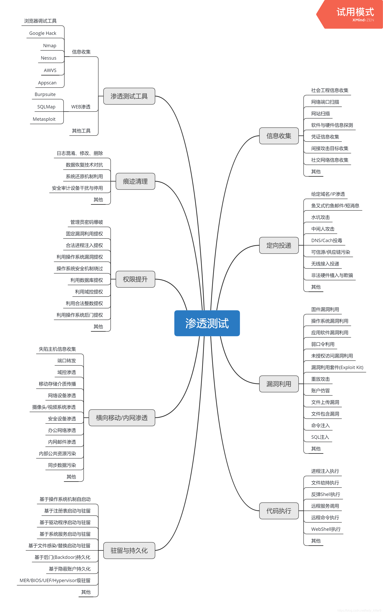

学习资料：[网络安全-自学笔记_网络安全学习_lady_killer9的博客-CSDN博客](https://blog.csdn.net/lady_killer9/article/details/106791542)

WEB编码：

ASCII编码：共定义了128个字符。每个字符一字节。

- 数字比字母小
- 大写字母要比小写字母小32
- 一般汉字由两个ASCII码表示

URL编码：

URL(**U**niform **R**esource **L**ocator，**统一资源定位器**、定位地址**，**俗称网页地址**，**简称**网址**)，是因特网上标准的资源地址。

URL编码的字符都以 % 作为前缀，也称为百分号编码。%20是空格，也可以对汉字进行编码。sql注入忠

